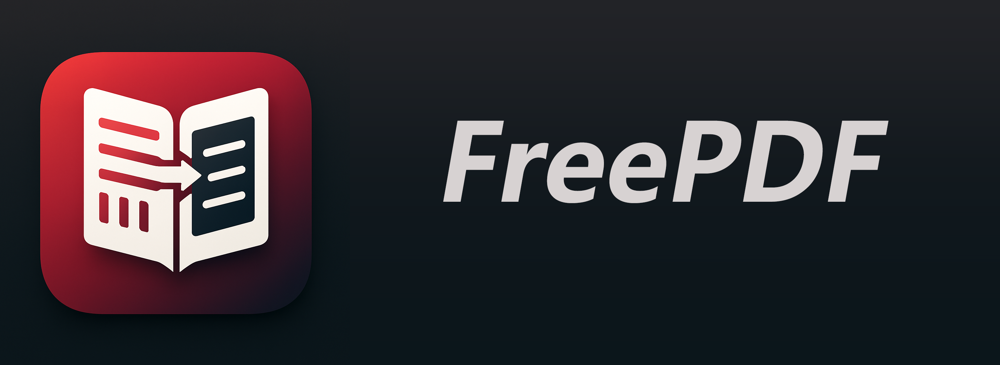

<div align="center">
  
</div>

<div align="center">
  
  <a href="LICENSE"></a>
  <h4>
    <a href="README.md">🇨🇳 中文</a>
    <span> | </span>
    <a href="README_EN.md">🇬🇧 English</a>
  </h4>
</div>

## ⭐️ 简介

这是主分支的预研版本，采用 pdf2zh_next（pdf2zh 2.x 版本）替换 pdf2zh 进行文献翻译，翻译整体效果优于pdf2zh。

当前 pdf2zh_next 接口文档不完善，部分接口不兼容，导致软件交互体验下降，遂不合并入主分支。

## 🔧 源码启动

配置环境：

```bash
uv venv --python 3.10
uv sync
```

启动应用：

```bash
python main.py
```


## 🛠️ 如何贡献

1. Fork本GitHub仓库
2. 将fork克隆到本地：  
`git clone git@github.com:<你的用户名>/FreePDF.git`
3. 创建本地分支：  
`git checkout -b my-branch`
4. 提交信息需包含充分说明：  
`git commit -m '提交信息需包含充分说明'`
5. 推送更改到GitHub（含必要提交信息）：  
`git push origin my-branch`
6. 提交PR等待审核