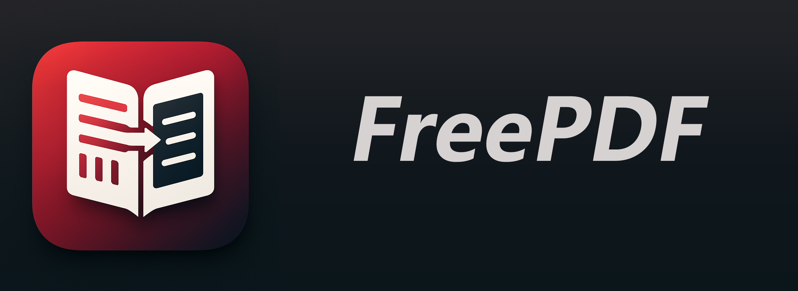

<div align="center">
  
</div>

<div align="center">
  
  <a href="LICENSE"></a>
  <h4>
    <a href="README.md">🇨🇳 中文</a>
    <span> | </span>
    <a href="README_EN.md">🇬🇧 English</a>
  </h4>
</div>

## ⭐️ 简介

一个免费的PDF文献阅读器，支持将各语言的PDF文献转成中文，并支持接入大模型基于文献内容进行问答。


## 🏗️ 效果演示

[](https://www.bilibili.com/video/BV11EgkziEFg)


## 📦 使用方式

- windows：

  - github：[https://github.com/zstar1003/FreePDF/releases/download/v5.1.2/FreePDF_v5.1.2.exe](https://github.com/zstar1003/FreePDF/releases/download/v5.1.2/FreePDF_v5.1.2.exe)

  - 夸克网盘：[https://pan.quark.cn/s/ee59aa67b65d](https://pan.quark.cn/s/ee59aa67b65d)

- mac(arm64)：

  - github：[https://github.com/zstar1003/FreePDF/releases/download/v5.1.2/FreePDF_v5.1.2_macOS.dmg](https://github.com/zstar1003/FreePDF/releases/download/v5.1.2/FreePDF_v5.1.2_macOS.dmg)

  - 夸克网盘：[https://pan.quark.cn/s/e96b0c3efc3a](https://pan.quark.cn/s/e96b0c3efc3a)

  - HomeBrew：运行`brew install freepdf`

翻译完的PDF文件，会在其对应目录下生成`-mono.pdf`(翻译文件)

## 🔧 源码启动

配置环境：

```bash
uv sync
```

启动应用：

```bash
python main.py
```


## 📥 配置说明

### 配置文件结构与参数说明

配置文件（pdf2zh_config.json）示例：

```json
{
  "models": {
    "doclayout_path": "./models/doclayout_yolo_docstructbench_imgsz1024.onnx"
  },
  "fonts": {
    "zh": "./fonts/SourceHanSerifCN-Regular.ttf",
    "ja": "./fonts/SourceHanSerifJP-Regular.ttf",
    "ko": "./fonts/SourceHanSerifKR-Regular.ttf",
    "zh-TW": "./fonts/SourceHanSerifTW-Regular.ttf",
    "default": "./fonts/GoNotoKurrent-Regular.ttf"
  },
  "translation": {
    "service": "bing", // 翻译引擎，可选：bing、google、silicon、ollama、自定义
    "lang_in": "en",   // 源语言，可选：en、zh、ja、ko、zh-TW
    "lang_out": "zh",  // 目标语言，同上
    "envs": {
      // bing/google无需配置
      // silicon示例：
      //   "SILICON_API_KEY": "你的API Key",
      //   "SILICON_MODEL": "Qwen/Qwen2.5-7B-Instruct"
      // ollama示例：
      //   "OLLAMA_HOST": "http://127.0.0.1:11434",
      //   "OLLAMA_MODEL": "deepseek-r1:1.5b"
      // 自定义示例：
      //   "CUSTOM_HOST": "https://api.xxx.com",
      //   "CUSTOM_KEY": "你的Key",
      //   "CUSTOM_MODEL": "模型名"
    }
  },
  "qa_engine": {
    "service": "关闭", // 问答引擎，可选：关闭、silicon、ollama、自定义
    "envs": {
      // 配置方式同上
    }
  },
  "qa_settings": {
    "pages": "", // 限定问答分析的PDF页面范围，格式如"1-5,8,10-15"，留空为全部页面
    "system_prompt": "你是一个专业的PDF文档分析助手。用户上传了一个PDF文档，你需要基于文档内容回答用户的问题。\n\nPDF文档内容如下：\n{pdf_content}\n\n请注意：\n1. 请仅基于上述PDF文档内容回答问题\n2. 如果问题与文档内容无关，请明确说明\n3. 回答要准确、详细，并引用相关页面信息\n4. 使用中文回答\n"
  },
  "translation_enabled": true, // 是否启用翻译
  "NOTO_FONT_PATH": "./fonts/SourceHanSerifCN-Regular.ttf", // 全局字体路径（
  "pages": "" // 全局页面范围
}
```

#### 字段说明
- `models.doclayout_path`：DocLayout-YOLO ONNX模型路径。
- `fonts`：各语言PDF渲染字体路径。
- `translation.service`：翻译引擎，支持bing、google、silicon、ollama、自定义。
- `translation.lang_in`/`lang_out`：源/目标语言，支持en（英文）、zh（中文）、ja（日语）、ko（韩语）、zh-TW（繁体中文）。
- `translation.envs`：不同翻译引擎的API参数，配置方式与下方`qa_engine.envs`完全一致，详见下方典型配置示例。
- `qa_engine.service`：问答引擎，支持关闭、silicon、ollama、自定义。
- `qa_engine.envs`：不同问答引擎的API参数，配置方式与上方`translation.envs`完全一致，详见下方典型配置示例。
- `qa_settings.pages`：问答时分析的PDF页面范围，格式如"1-5,8,10-15"。
- `qa_settings.system_prompt`：问答系统提示词，{pdf_content}占位符表示具体的文档内容。
- `translation_enabled`：是否启用翻译（true/false）。
- `NOTO_FONT_PATH`：全局字体路径。
- `pages`：全局页面范围。

#### 典型配置示例
- **硅基流动翻译/问答**：
  ```json
  "service": "silicon",
  "envs": {
    "SILICON_API_KEY": "你的API Key",
    "SILICON_MODEL": "Qwen/Qwen2.5-7B-Instruct"
  }
  ```
- **Ollama本地大模型**：
  ```json
  "service": "ollama",
  "envs": {
    "OLLAMA_HOST": "http://127.0.0.1:11434",
    "OLLAMA_MODEL": "deepseek-r1:1.5b"
  }
  ```
- **自定义OpenAI兼容API**：
  ```json
  "service": "自定义",
  "envs": {
    "CUSTOM_HOST": "https://api.xxx.com",
    "CUSTOM_KEY": "你的Key",
    "CUSTOM_MODEL": "模型名"
  }
  ```

> 无论是翻译还是问答，envs字段的填写方式完全一致，仅需根据所选引擎填写对应参数。
> 配置文件建议用记事本/VSCode等编辑，注意JSON格式不能有注释，所有注释仅供参考。

可选翻译引擎：

- 必应翻译(默认)  
  
  选择翻译引擎为bing，无需额外参数

- 谷歌翻译  
  
  选择翻译引擎为google，无需额外参数

- 硅基翻译  
  
  选择翻译引擎为silicon，需额外配置[硅基流动](https://cloud.siliconflow.cn/i/bjDoFhPf)API Key和具体聊天模型。

- Ollama翻译  

  选择翻译引擎为ollama，先通过ollama部署本地chat模型，并配置ollama地址和具体聊天模型。

- 自定义翻译

  其它符合`OpenAi API`的自定义模型引擎，如火山引擎。

支持五种语言互相翻译：中文、英文、日文、韩文、繁体中文。

问答引擎支持硅基流动(在线)、ollama(本地)和其它符合`OpenAi API`的自定义方式。

## ❓ 常见问题

1. 支持图片型PDF吗，比如扫描件？    
  **回答：** 不支持，本质上是借助`pdf2zh`检测文本块内容，再进行翻译替换，图片型无法直接替换，会导致内容重合叠加。

2. 使用大模型翻译时，有些内容没有翻译？  
  **回答：** 低参数量的大模型本身的指令遵循能力很差，让它翻译，它可能不会完全听话，就会造成此现象。因此，本地用大模型翻译，必须保证大模型本身具备一定参数规模，建议7B以上。

3. 表格中的内容没有翻译？  
  **回答：** pdf2zh暂不支持表格内容翻译，如需翻译表格，可查看本仓库的`dev`分支，采用`pdf2zh_next`进行翻译，但由于速度较慢，未合并进主分支。

4. win版报错：无法打开要写入的文件 `C:\Program Files\FreePDF\internal\ucrtbase.dll`
  **回答：** 关闭杀毒软件，右键用管理员身份运行软件。

如有其它问题，欢迎提交 issue 或 直接联系我的微信 zstar1003 反馈问题。

## 🛠️ 如何贡献

1. Fork本GitHub仓库
2. 将fork克隆到本地：  
`git clone git@github.com:<你的用户名>/FreePDF.git`
3. 创建本地分支：  
`git checkout -b my-branch`
4. 提交信息需包含充分说明：  
`git commit -m '提交信息需包含充分说明'`
5. 推送更改到GitHub（含必要提交信息）：  
`git push origin my-branch`
6. 提交PR等待审核

## 🚀 鸣谢

本项目基于以下开源项目开发：

- [PDFMathTranslate](https://github.com/Byaidu/PDFMathTranslate)

- [DocLayout-YOLO](https://github.com/opendatalab/DocLayout-YOLO)

- [PyQt6](https://www.riverbankcomputing.com/software/pyqt)

- [pdf.js](https://github.com/mozilla/pdf.js)
