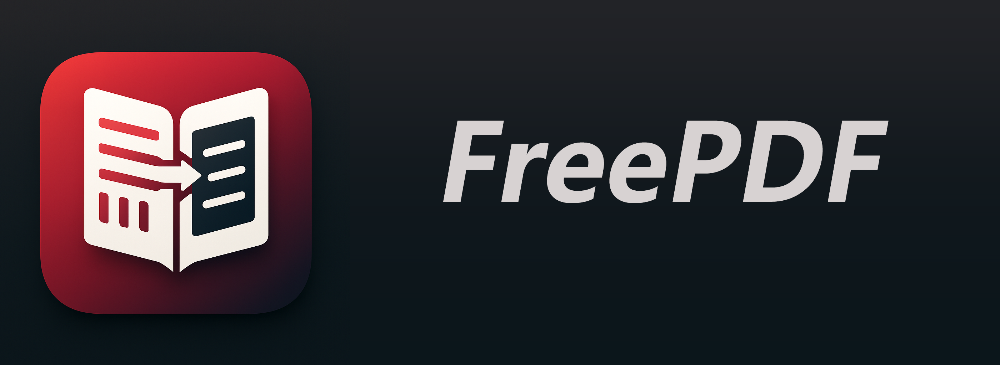

<div align="center">



</div>

<div align="center">


<a href="LICENSE"></a>

<h4>

<a href="README.md">🇨🇳 中文</a>

<span> | </span>

<a href="README_EN.md">🇬🇧 English</a>

</h4>

</div>

## ⭐️ Introduction

A free PDF document reader that supports converting PDF documents in various languages ​​to Chinese and supports integration with large-scale models for question answering based on document content.

## 🏗️ Demo

[](https://www.bilibili.com/video/BV11EgkziEFg)

## 📦 How to Use

- Windows:

- GitHub: [https://github.com/zstar1003/FreePDF/releases/download/v6.0.2/FreePDF_v6.0.2.exe](https://github.com/zstar1003/FreePDF/releases/download/v6.0.2/FreePDF_v6.0.2.exe)

- Quark Drive: [https://pan.quark.cn/s/ee59aa67b65d](https://pan.quark.cn/s/ee59aa67b65d)

- Mac (arm64):

- GitHub: [https://github.com/zstar1003/FreePDF/releases/download/v6.0.2/FreePDF_v6.0.2_macOS.dmg](https://github.com/zstar1003/FreePDF/releases/download/v6.0.2/FreePDF_v6.0.2_macOS.dmg)

- Quark Drive: [https://pan.quark.cn/s/e96b0c3efc3a](https://pan.quark.cn/s/e96b0c3efc3a)

- HomeBrew: Run `brew install` freepdf

### Choose an installer

| Package | Reader | When to choose it |
| --- | --- | --- |
| [Windows standard](https://github.com/zstar1003/FreePDF/releases/download/v6.0.2/FreePDF_v6.0.2.exe) | PDF.js (default) | Recommended for regular use and the PDF.js reading tools |
| [Windows native preview edition](https://github.com/zstar1003/FreePDF/releases/download/v6.0.2/FreePDF_v6.0.2_Windows_Native.exe) | Qt PDF, without WebEngine | Choose it if WebEngine DLL errors or blank previews occur |
| [macOS ARM64 standard](https://github.com/zstar1003/FreePDF/releases/download/v6.0.2/FreePDF_v6.0.2_macOS.dmg) | PDF.js | Apple Silicon; Developer ID signed and Apple notarized |

Both Windows packages include translation, Q&A, export and diagnostic logs. The native edition installs as **FreePDF Native** alongside the standard edition and provides page navigation, zoom and fit-to-width controls. The standard edition also attempts native recovery when PDF.js fails. The native source is in the [`codex/windows-native-v6.0.2`](https://github.com/zstar1003/FreePDF/tree/codex/windows-native-v6.0.2) branch; main defaults to PDF.js. About identifies the installed edition. GitHub Release includes all three packages and SHA256 checksums; mirrors and Homebrew may update later.

### Live progress and partial translations

Click the bottom-left status, progress bar or percentage to open live details: actual stage, current page, saved pages, paragraph processing and waiting time. Progress advances only after pages are saved. The compact details window wraps long filenames and errors. After a translation failure, use Engine configuration to switch the translation engine and Test connection before retrying.

Each completed page is saved and displayed immediately. A timeout, error or “Stop and keep” preserves completed work for reading and export. `name-partial-mono.pdf` preserves the original page count and order; pending pages retain their original contents. `name-partial.freepdf.json` stores the checkpoint. Use “Continue translation” in the progress window or reimport the same PDF to resume when the source and translation settings match. Keep both checkpoint files until completion.

Successful completion creates `name-mono.pdf` and removes the partial PDF/checkpoint. Optional side-by-side saving creates `name-dual.pdf`. The toolbar export action supports side-by-side or translation-only output; About provides a redacted diagnostic ZIP export.


## 🔧 Source Code Startup

Configuration Environment:

```bash
uv sync

```
Start the Application:

```bash
python main.py

```
## 📥 Configuration Instructions

### Configuration File Structure and Parameter Description

Configuration File (pdf2zh_config.json) Example:

```json

{
"models": {

"doclayout_path": "./models/doclayout_yolo_docstructbench_imgsz1024.onnx"

},

"fonts": {

"zh": "./fonts/SourceHanSerifCN-Regular.ttf",

"ja": "./fonts/SourceHanSerifJP-Regular.ttf",

"ko": "./fonts/SourceHanSerifKR-Regular.ttf",

"zh-TW": "./fonts/SourceHanSerifTW-Regular.ttf",

"default": "./fonts/GoNotoKurrent-Regular.ttf"

},

"translation": {

"service": "bing", // Translation engine, options: bing, google, silicon, ollama, custom

"lang_in": "en", // Source language, options: en, zh, ja, ko, zh-TW

"lang_out": "zh", // Target language, same as above

"envs": {

// bing/google no configuration required

// silicon example:

// "SILICON_API_KEY": "Your API Key",

// "SILICON_MODEL": "Qwen/Qwen2.5-7B-Instruct"

// ollama example:

// "OLLAMA_HOST": "http://127.0.0.1:11434",

// "OLLAMA_MODEL": "deepseek-r1:1.5b"

// Custom example:

// "CUSTOM_HOST": "https://api.xxx.com",

// "CUSTOM_KEY": "Your Key",

// "CUSTOM_MODEL": "Model Name"

}
},

"qa_engine": {

"service": "Off", // Question answering engine, options: Off, Silicon, Ollama, Custom

"envs": {

// Configuration method is the same as above

}
},

"qa_settings": {

"pages": "", // Limit the range of PDF pages for question answering analysis, format such as "1-5,8,10-15", leave blank for all pages

"system_prompt": "You are a professional PDF document analysis assistant. A user has uploaded a PDF document, and you need to answer the user's questions based on the document content.\n\nThe PDF document content is as follows:\n{pdf_content}\n\nPlease note:\n1. Please answer the questions only based on the above PDF document content\n2. If the question is unrelated to the document content, please clearly state this\n3. Answers should be accurate, detailed, and cite relevant page information\n4. Answer in Chinese\n"

},

"translation_enabled": true, // Whether to enable translation

"NOTO_FONT_PATH": "./fonts/SourceHanSerifCN-Regular.ttf", // Global font path (

"pages": "" // Global page range

}
```

#### Field Description

- `models.doclayout_path`: DocLayout-YOLO ONNX model path.

- `fonts`: Font path for PDF rendering in various languages.

- `translation.service`: Translation engine, supports Bing, Google, Silicon, Ollama, and custom.

- `translation.lang_in`/`lang_out`: Source/target language, supporting en (English), zh (Chinese), ja (Japanese), ko (Korean), and zh-TW (Traditional Chinese).

- `translation.envs`: API parameters for different translation engines. The configuration method is exactly the same as `qa_engine.envs` below; see the typical configuration example below for details.

- `qa_engine.service`: Question answering engine, supporting off, silicon, ollama, and custom.

- `qa_engine.envs`: API parameters for different question answering engines. The configuration method is exactly the same as `translation.envs` above; see the typical configuration example below for details.

- `qa_settings.pages`: The range of PDF pages analyzed during question answering, formatted as "1-5,8,10-15".

- `qa_settings.system_prompt`: Question answering system prompts; the `{pdf_content}` placeholder represents the specific document content.

- `translation_enabled`: Whether translation is enabled (true/false).

- `NOTO_FONT_PATH`: Global font path.

- `pages`: Global page scope.

#### Typical Configuration Example

- **Silicon-based Flow Translation/Question Answering**:

``json

"service": "silicon",

"envs": {

"SILICON_API_KEY": "Your API Key",

"SILICON_MODEL": "Qwen/Qwen2.5-7B-Instruct"

}
``
- **Ollama Local Large Model**:

``json

"service": "ollama",

"envs": {

"OLLAMA_HOST": "http://127.0.0.1:11434",

"OLLAMA_MODEL": "deepseek-r1:1.5b"

}
``
- **Custom OpenAI Compatible API**:

``json

"service": "Custom",

"envs": {

"CUSTOM_HOST": "https://api.xxx.com",

"CUSTOM_KEY": "Your Key",

"CUSTOM_MODEL": "Model Name"

}
```

> Whether for translation or Q&A, the envs field is filled in exactly the same way; only the corresponding parameters need to be filled in according to the selected engine.

> It is recommended to edit the configuration file with Notepad/VSCode, etc. Note that JSON format should not have comments; all comments are for reference only.


Optional Translation Engines:

- Bing Translation (Default)

Selecting Bing as the translation engine requires no additional parameters.

- Google Translate

Selecting Google as the translation engine requires no additional parameters.

- Silicon-based Translation

Selecting Silicon as the translation engine requires additional configuration of the [Silicon Flow](https://cloud.siliconflow.cn/i/bjDoFhPf) API Key and the specific chat model.

- Ollama Translation

Choose Ollama as the translation engine. First, deploy a local chat model using Ollama and configure the Ollama address and specific chat model.

- Custom Translation

Other custom model engines compliant with the `OpenAi API`, such as Volcano Engine.

Supports mutual translation between five languages: Chinese, English, Japanese, Korean, and Traditional Chinese.

The question-answering engine supports Silicon-based streaming (online), Ollama (local), and other custom methods compliant with the `OpenAi API`.

## ❓ Frequently Asked Questions

1. Does it support image-based PDFs, such as scanned documents?

**Answer:** No. Essentially, it uses `pdf2zh` to detect text block content and then translates and replaces it. Image-based PDFs cannot be directly replaced, which would result in overlapping content.

2. When using a large model for translation, some content is not translated?

**Answer:** Large models with low parameter counts often have poor instruction compliance, making them unresponsive to translation and causing this issue. Therefore, when translating large models locally, it's crucial to ensure they have a sufficient parameter size, ideally 7 bytes or more.

3. Why are the contents of the table not translated?

**Answer:** pdf2zh currently does not support translating table content. To translate tables, please check the `dev` branch of this repository and use `pdf2zh_next`. However, due to its slow speed, it hasn't been merged into the main branch.

For other questions, please submit an issue or contact me directly via WeChat (zstar1003) to report problems.

## 🛠️ How to Contribute

1. Fork this GitHub repository

2. Clone the fork to your local machine:

`git clone git@github.com:<your username>/FreePDF.git`

3. Create your local machine